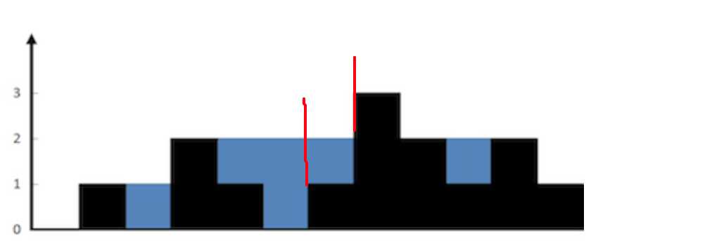

## 总思路：双指针
## 算法思路

  
- 将承接的水比做成多个水桶装的水累计到一起的。
- 将每个位置比做成宽度为1的木桶
- 每个水桶能装多少的水，取决于俩边的“木板”最低的那块
- 左边木板的最大值是左侧的所有木板的最大值，同理右边的木板最大值也是这样的
- 计算每个位置“左侧木板”最大值：
  - 将当前位置的值和左侧木板最大值取最大即可
- 右侧木板值同理
- 这样就获得了每个位置“木桶”的左右“木板”最大值了。由于木桶效应，能呈水的多少取决于最短的木板。因此，取左右木板值最小的，然后和当前位置的高度做差就是能存储的水了
- 最后做一个累计
